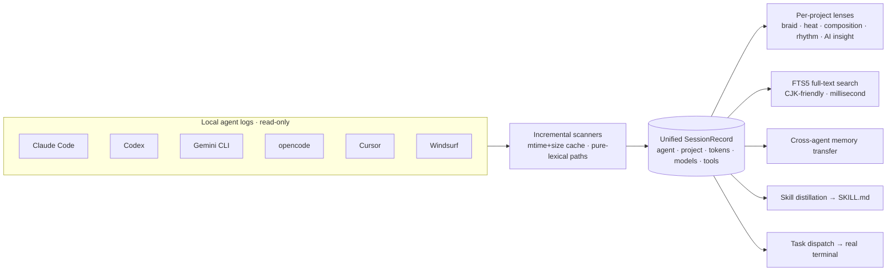

<div align="center">


<pre>
██╗   ██╗██╗████████╗██████╗ ██╗███╗   ██╗███████╗
██║   ██║██║╚══██╔══╝██╔══██╗██║████╗  ██║██╔════╝
██║   ██║██║   ██║   ██████╔╝██║██╔██╗ ██║█████╗
╚██╗ ██╔╝██║   ██║   ██╔══██╗██║██║╚██╗██║██╔══╝
 ╚████╔╝ ██║   ██║   ██║  ██║██║██║ ╚████║███████╗
  ╚═══╝  ╚═╝   ╚═╝   ╚═╝  ╚═╝╚═╝╚═╝  ╚═══╝╚══════╝
</pre>

**A native macOS glass cockpit for every local AI agent.**
<br/>把所有本地 AI-agent 会话，聚合成一个玻璃质感的统一指挥中心。

<p><strong>6 agents · one command center · local-first · read-only · zero third-party deps</strong></p>

<p>
  
  
  
  <a href="https://github.com/zzw4257/vitrine/actions/workflows/build.yml"></a>
  <a href="LICENSE"></a>
  
</p>

<p>
  <strong>English</strong> ·
  <a href="README.zh-CN.md">简体中文</a>
  &nbsp;|&nbsp;
  <a href="#quick-start"><strong>Quick Start</strong></a> ·
  <a href="#agent-sources"><strong>Agents</strong></a> ·
  <a href="#panels"><strong>Panels</strong></a> ·
  <a href="#themes"><strong>Themes</strong></a> ·
  <a href="PRIMITIVE.md"><strong>🧬 Primitive</strong></a>
</p>

</div>

---

Every local AI-agent CLI already records everything it does, then buries it in its own directory where nothing else can see it. Vitrine reads all of it — Claude Code, Codex, Gemini CLI, opencode, Cursor, Windsurf — regroups it by project, and answers one question at a glance: **which agent, in which project, when, did what, at what token cost, on which model.** From there you search it, carry its memory forward, distill its skills, and launch the next task.

Pure SwiftUI + Liquid Glass on macOS 26. Everything runs locally, offline, read-only. No telemetry, no third-party dependencies.

> 🧬 This repository ships a companion artifact: [**PRIMITIVE.md**](PRIMITIVE.md) — the *generative primitive* behind Vitrine. It compresses the product's essence into a seed you can hand to an agent, which then regrows another Vitrine in any stack. This macOS build is the first tree from that seed.

## Agent sources

Six on-disk formats, one unified `Session`. Reading is strictly local and read-only.

| Agent | Source | Extracted |
|-------|--------|-----------|
| **Claude Code** | `~/.claude/projects/**/*.jsonl` | cwd · branch · model · per-turn tokens · tools/commands · prompts |
| **Codex** | `~/.codex/sessions/**/rollout-*.jsonl` | cwd · model · token_count · shell commands · subagents |
| **Gemini CLI** | `~/.gemini/tmp/<sha256(cwd)>/chats/*.json` | per-message model + tokens (hashed dir resolved back to the project) |
| **opencode** | `~/.local/share/opencode/storage/{session,message}` | session metadata · message counts |
| **Cursor** | `~/.cursor/ai-tracking/ai-code-tracking.db` | conversation summaries (title/overview/model, read-only SQLite) |
| **Windsurf** | `~/.codeium/windsurf/code_tracker/` | activity footprint (transcripts are encrypted locally; Vitrine recovers touched files only) |

<sub>Honesty first: Windsurf encrypts its transcripts on disk (measured ~8.0 bits/byte of entropy), so Vitrine surfaces the recoverable file footprint and labels it plainly rather than fabricating content.</sub>

## How it works



## Panels

| Panel | What it does |
|-------|--------------|
| **Overview** | Aggregate stats · half-year activity heatmap with hover readouts · an interactive composition donut that switches Agent↔model and messages↔throughput (hover a slice to pop it out, the hole reads live) · recent sessions as **list / masonry / grid** |
| **Projects** | Five lenses over one project's many contributors: **braid** (a lane per agent — the gaps show exactly when each one paused and who took over), heatmap, composition, rhythm, and AI insight |
| **Search** | SQLite **FTS5 trigram** index, CJK-friendly, sub-3-char queries fall back to LIKE, hit highlighting, agent filters |
| **Memory Studio** | Extract, merge, and transfer memory across agents — CLAUDE.md ⇄ AGENTS.md ⇄ GEMINI.md ⇄ .cursorrules ⇄ .windsurfrules — with an automatic `.bak` before every write |
| **Skill Distillery** | Distill conventions, commands, and workflows from real session behavior into an editable `SKILL.md`; heuristic or AI-deep (with a focus: all / conventions / commands / workflow); inject into **7 targets** across Claude, Codex, Gemini, Cursor, and Windsurf |
| **Dispatch** | Pick a project + an agent, inject a project briefing (`.vitrine-briefing.md`), generate the launch command, and fire it in a real terminal — with live detection of running agent processes |

<sub>Browse lists and search hide low-signal sessions (the tool's own summary/distill meta-calls, trivial runs) by default and expand on one click. Aggregates always count everything.</sub>

## Themes

A theme carries a full set of structural tokens — surface material, backdrop, corner radius, borders, typography, texture. Switching themes reshapes the whole design language down to the material and type, well past a palette swap.

- **Vitrine family** (Nebula · Sunset · Ocean · Tundra · Graphite): Liquid Glass cards over a drifting aurora, each with its own **backdrop pattern** (dot grid, diagonal, contour, plus-grid, mesh) and slow **ambient motes**.
- **Apple** (dark & light): vibrancy material, bright light-catching top edges, soft shadows, 15px squircles, a calm desktop-style wash, systemBlue.
- **GitHub** (dark & light): Primer's flat canvas, solid cards with 1px hairline borders, 8px corners, real contribution-green heatmaps, no glass blur.

Appearance settings add live glass-opacity, border-strength, and aurora-intensity dials. All motion honors the system Reduce Motion setting.

## Quick Start

```sh
git clone https://github.com/zzw4257/vitrine.git
cd vitrine
./build.sh            # swift build -c release + assemble Vitrine.app (with a generated prism icon)
open build/Vitrine.app
```

Requires **Xcode 26 / Swift 6 / macOS 26+**. First launch plays a short onboarding (scan → theme → connect AI → ready).

Prefer a binary? Grab `Vitrine.app.zip` from [**Releases**](https://github.com/zzw4257/vitrine/releases) (ad-hoc signed — first open: right-click → Open).

## 🧬 The Primitive

In the AI era, a product's most portable value is its **primitive** — the essence that makes it what it is and lets it be regrown.

[**PRIMITIVE.md**](PRIMITIVE.md) is exactly that for Vitrine: the core idea, the load-bearing invariants, the one thing each concept must nail, the aesthetic and motion philosophy, and a ready-to-paste **regeneration prompt**. Hand it to any capable agent and it grows a new Vitrine in a stack of your choice — a different skin, the same soul. The file stands on its own as part of this open-source release.

## Architecture

<details>
<summary><strong>Scanning · indexing · rendering · privacy</strong></summary>

- **Incremental scan** — cached by file mtime+size (`~/Library/Application Support/Vitrine/scan-cache-v2.json`) with tombstones for empty files; the first scan is full, every scan after is instant, new sessions stream in.
- **Hashed-project resolution** — Gemini names directories `sha256(cwd)`; Vitrine hashes every known project path to build a reverse lookup and restore ownership.
- **Token accounting** — `throughput = input + output + cache_read + cache_creation`. Agents re-read the whole context from cache each turn, so output-only counting under-reports by orders of magnitude; a single large session runs into the hundreds of millions.
- **Pure-lexical paths** — Vitrine avoids `standardizingPath` (it stats the filesystem and trips the macOS Documents permission prompt) and normalizes paths lexically instead.
- **Glass + aurora + texture** — `GlassEffectContainer` / `glassEffect` plus a `Canvas`-drawn aurora, backdrop pattern, and ambient motes; every chart (donut, bars, heatmap, rhythm) highlights on hover with a live readout.
- **Privacy** — read-only, offline, local. The only writes are the ones you start in Memory Studio or the Distillery, each backed up first. No telemetry, no network unless you configure a cloud AI provider yourself.

</details>

<details>
<summary><strong>AI integration (cloud · local llama.cpp · local Claude CLI)</strong></summary>

Summaries, deep skill distillation, and project insight all route through one `AIClient`:

- **Cloud, OpenAI-compatible** (OpenAI/DeepSeek/Kimi/OpenRouter/Together/Groq/custom): `GET /models`, `POST /chat/completions`, two-step test; the key pre-fills from `OPENAI_API_KEY` or `~/.codex/auth.json`.
- **Local llama.cpp** — Ollama (`GET /api/tags`, streaming `POST /api/pull` with a progress bar, one-click `ollama serve`) and llama-server (point at a GGUF + port, launch, poll `/health`).
- **Local Claude CLI** — calls your logged-in `claude -p` directly, no API key.

</details>

<details>
<summary><strong>Debug entry points (environment variables)</strong></summary>

Run the bundled binary with environment variables to jump straight to a screen (handy for screenshots):

```sh
BIN=build/Vitrine.app/Contents/MacOS/Vitrine
env VITRINE_SECTION=search VITRINE_QUERY=triton "$BIN"
env VITRINE_SECTION=dashboard VITRINE_COMPOSITION=model "$BIN"
```

`VITRINE_SECTION` ∈ `dashboard|projects|search|memory|distillery|dispatch`; also `VITRINE_QUERY`, `VITRINE_PROJECT`, `VITRINE_PERSPECTIVE`, `VITRINE_COMPOSITION=model`, `VITRINE_OPEN_SETTINGS=1`, `VITRINE_FLOAT=1`.

</details>

## License

[MIT](LICENSE) © 2026 [zzw4257](https://github.com/zzw4257)
