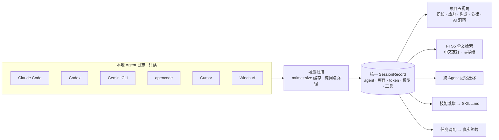

<div align="center">


# Vitrine

**原生 macOS 的全 Agent 玻璃指挥中心。**
<br/>A native macOS glass cockpit for every local AI agent.

<p><strong>6 个 Agent · 一个指挥中心 · 本地优先 · 只读 · 零第三方依赖</strong></p>

<p>
  
  
  
  <a href="https://github.com/zzw4257/vitrine/actions/workflows/build.yml"></a>
  <a href="LICENSE"></a>
  
</p>

<p>
  <a href="README.md">English</a> ·
  <strong>简体中文</strong>
  &nbsp;|&nbsp;
  <a href="#快速开始"><strong>快速开始</strong></a> ·
  <a href="#agent-数据源"><strong>Agent 源</strong></a> ·
  <a href="#面板"><strong>面板</strong></a> ·
  <a href="#主题"><strong>主题</strong></a> ·
  <a href="PRIMITIVE.md"><strong>🧬 原语</strong></a>
</p>

</div>

---

每个本地 AI-agent CLI 都完整记录了自己做过的每一件事，然后把它埋进各自的目录，彼此不相往来。Vitrine 把它们全部读进来 —— Claude Code、Codex、Gemini CLI、opencode、Cursor、Windsurf —— 按项目重组，一眼回答一个问题：**哪个 Agent、在哪个项目、什么时候、做了什么、烧了多少 token、用了哪个模型。** 由此你可以检索它、迁移它的记忆、蒸馏它的技能，再从这里把下一个任务派出去。

纯 SwiftUI + Liquid Glass，macOS 26。全程本地、离线、只读，无遥测，零第三方依赖。

> 🧬 本仓库附带一份特别的产物：[**PRIMITIVE.md**](PRIMITIVE.md) —— Vitrine 的**生成原语**。它把这个产品的本质压缩成一颗种子，交给任意 agent，就能在任意技术栈里长出另一个 Vitrine。这个 macOS 版本，是这颗种子长出的第一棵树。

## Agent 数据源

六种磁盘格式，统一成同一种 `Session`。扫描严格本地、只读。

| Agent | 来源 | 提取 |
|-------|------|------|
| **Claude Code** | `~/.claude/projects/**/*.jsonl` | cwd · 分支 · 模型 · 逐轮 token · 工具/命令 · 提问 |
| **Codex** | `~/.codex/sessions/**/rollout-*.jsonl` | cwd · model · token_count · shell 命令 · 子代理 |
| **Gemini CLI** | `~/.gemini/tmp/<sha256(cwd)>/chats/*.json` | 每条消息的 model + tokens（哈希目录反查回项目） |
| **opencode** | `~/.local/share/opencode/storage/{session,message}` | 会话元数据 · 消息计数 |
| **Cursor** | `~/.cursor/ai-tracking/ai-code-tracking.db` | 会话摘要（标题/概述/模型，只读 SQLite） |
| **Windsurf** | `~/.codeium/windsurf/code_tracker/` | 活动足迹（转录本地加密，仅还原触碰的文件） |

<sub>诚实原则：Windsurf 的转录在本地加密（实测约 8.0 bits/byte 熵）。Vitrine 只呈现能还原的文件足迹并如实标注，绝不编造内容。</sub>

## 工作原理



## 面板

| 面板 | 能力 |
|------|------|
| **总览** | 聚合统计 · 半年活跃热力图（悬停读数）· 可切维度的构成甜甜圈（Agent↔模型 × 消息↔吞吐，悬停扇区弹出、圆心实时读数）· 最近会话支持**列表 / 瀑布流 / 方格** |
| **项目** | 一个项目下多贡献者的五视角：**织线**（每 Agent 一条泳道，空隙一眼看出谁在何时停摆、谁接手）、热力、构成、节律、AI 洞察 |
| **检索** | SQLite **FTS5 三元组**索引，中文友好，<3 字自动降级 LIKE，命中词高亮，按 Agent 过滤 |
| **记忆工坊** | 跨 Agent 提取、合并、迁移记忆 —— CLAUDE.md ⇄ AGENTS.md ⇄ GEMINI.md ⇄ .cursorrules ⇄ .windsurfrules —— 每次写入前自动 `.bak` 备份 |
| **技能蒸馏** | 从真实会话行为蒸馏规范/命令/工作流 → 可编辑 `SKILL.md`；启发式即时或 AI 深度（可选侧重：全面/规范/命令/工作流）；一键注入横跨 Claude、Codex、Gemini、Cursor、Windsurf 的 **7 类目标** |
| **任务调配** | 选项目 + 选 Agent + 注入项目简报（`.vitrine-briefing.md`）→ 生成启动命令一键在终端拉起，实时检测运行中的 Agent 进程 |

<sub>浏览列表与检索默认隐藏低信号会话（工具自身产生的总结/蒸馏元会话、极小会话），一键展开。统计聚合始终计入全部。</sub>

## 主题

每个主题携带一整套结构令牌 —— 表面材质、背景形态、圆角、边框、排版、纹理。换主题会重塑整套设计语言，深入到材质与排版，远超换色的层次。

- **Vitrine 玻璃系**（星云 · 落日 · 深海 · 苔原 · 石墨）：Liquid Glass 卡片浮于漂移极光之上，各带专属**背景纹理**（点阵/斜纹/等高线/十字网/网格）与缓慢的**环境光点**。
- **Apple**（深/浅）：vibrancy 材质、顶部亮边、柔和投影、15px squircle 圆角、平静的桌面式 wash、systemBlue。
- **GitHub**（深/浅）：Primer 纯平画布、实心卡片配 1px 硬边框、8px 圆角、真实贡献图绿阶热力，无玻璃模糊。

外观设置提供玻璃通透度、边框分离度、极光活跃度三个实时旋钮。全部动效兼容系统「减弱动效」。

## 快速开始

```sh
git clone https://github.com/zzw4257/vitrine.git
cd vitrine
./build.sh            # swift build -c release + 组装 Vitrine.app（含生成的棱镜图标）
open build/Vitrine.app
```

要求 **Xcode 26 / Swift 6 / macOS 26+**。首启会播放一段仪式感开屏引导（扫描 → 选色调 → 接入 AI → 就绪）。

想直接拿二进制？到 [**Releases**](https://github.com/zzw4257/vitrine/releases) 下载 `Vitrine.app.zip`（ad-hoc 签名，首次打开：右键 → 打开）。

## 🧬 原语

在 AI 时代，一个产品最可迁移的价值是它的**原语** —— 那套让它成为它、并能被重新生长的本质。

[**PRIMITIVE.md**](PRIMITIVE.md) 就是 Vitrine 的这份原语：核心理念、承重的不变量、每个概念构件必须做对的那一件事、美学与动效哲学，以及一段可直接粘贴的**再生提示词**。把它交给任意有能力的 agent，它就在你选的技术栈里长出一个新的 Vitrine —— 换一层皮，同一个灵魂。这份文件作为本开源项目独立的一部分存在。

## 架构

<details>
<summary><strong>扫描 · 索引 · 渲染 · 隐私</strong></summary>

- **增量扫描** —— 按文件 mtime+size 缓存（`~/Library/Application Support/Vitrine/scan-cache-v2.json`），空文件记 tombstone；首扫全量，之后秒开，新会话流式入表。
- **哈希项目反查** —— Gemini 用 `sha256(cwd)` 命名目录；Vitrine 对所有已知项目路径求哈希建反查表还原归属。
- **Token 口径** —— `吞吐 = input + output + cache_read + cache_creation`。Agent 每轮从缓存重读整个上下文，只算 output 会低估几个数量级 —— 单个大会话动辄上亿。
- **纯词法路径** —— 避开 `standardizingPath`（它会 stat 文件系统、触发 macOS Documents 授权弹窗），改用纯词法归一化。
- **玻璃 + 极光 + 纹理** —— `GlassEffectContainer` / `glassEffect` 配合 `Canvas` 手绘极光、背景纹理与环境光点；每张图表（甜甜圈/条形/热力/节律）悬停高亮并实时读数。
- **隐私** —— 只读、离线、本地。唯一的写入是你在记忆工坊或蒸馏台里主动发起的，且写前备份。无遥测；除非你自己配置云端 AI 服务商，否则不联网。

</details>

<details>
<summary><strong>AI 接入（云端 · 本地 llama.cpp · 本地 Claude CLI）</strong></summary>

会话总结、技能深度蒸馏、项目洞察共用一套 `AIClient`：

- **云端 OpenAI 兼容**（OpenAI/DeepSeek/Kimi/OpenRouter/Together/Groq/自定义）：`GET /models`、`POST /chat/completions`、两步测试；Key 首次从 `OPENAI_API_KEY` 或 `~/.codex/auth.json` 预填。
- **本地 llama.cpp** —— Ollama（`GET /api/tags`、流式 `POST /api/pull` 带进度条、一键 `ollama serve`）与 llama-server（指定 GGUF + 端口一键拉起、轮询 `/health`）。
- **本地 Claude CLI** —— 直接调用已登录的 `claude -p`，无需 API Key。

</details>

<details>
<summary><strong>调试入口（环境变量）</strong></summary>

运行 bundle 内二进制并设环境变量可直达指定页面（便于截图）：

```sh
BIN=build/Vitrine.app/Contents/MacOS/Vitrine
env VITRINE_SECTION=search VITRINE_QUERY=triton "$BIN"
env VITRINE_SECTION=dashboard VITRINE_COMPOSITION=model "$BIN"
```

`VITRINE_SECTION` ∈ `dashboard|projects|search|memory|distillery|dispatch`；另有 `VITRINE_QUERY`、`VITRINE_PROJECT`、`VITRINE_PERSPECTIVE`、`VITRINE_COMPOSITION=model`、`VITRINE_OPEN_SETTINGS=1`、`VITRINE_FLOAT=1`。

</details>

## 许可

[MIT](LICENSE) © 2026 [zzw4257](https://github.com/zzw4257)
